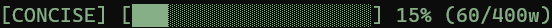

<div align="center">

# CONCISE

[](https://github.com/0xyph3r/CONCISE/actions/workflows/test.yml)
[](LICENSE)
[](#install-the-full-plugin-claude-code-only)
[](https://agentskills.io)

</div>

Cuts prose filler from AI coding agent responses - trailing summaries,
restated context, hedging, over-long preambles - while leaving code, commit
messages, and analysis depth fully intact. Covers subagents too, not just
the main session.



<p align="center">
  <a href="#install-on-any-agent-skills-compatible-tool">Install</a> •
  <a href="#before--after">Before / After</a> •
  <a href="#how-it-works">How it works</a> •
  <a href="#commands">Commands</a> •
  <a href="#configuration">Configuration</a> •
  <a href="#benchmarks">Benchmarks</a> •
  <a href="#support">Support</a>
</p>

Works two ways:

- **Full plugin (Claude Code only):** the compression rules, plus a live
  per-response prose-budget bar in the statusline that measures every
  response as it happens - main session and subagents alike.
- **Agent Skills (any compatible tool):** the same compression rules as a
  portable skill - Claude Code, Cursor, GitHub Copilot, Codex, Gemini CLI,
  and every other tool that supports the open [Agent Skills](https://agentskills.io)
  format. No live bar outside Claude Code - most tools have no equivalent
  of its per-turn measurement hooks to drive one.

## Before / After

**Before:**

> Sure! I'd be happy to help you with that. Let me take a look at the file
> first.
>
> Great, I found the issue! The problem is that the function is checking
> `if (x = 5)` instead of `if (x == 5)`, which is an assignment rather than
> a comparison. This is a very common bug in JavaScript and other C-like
> languages. Let me fix that for you now.
>
> I've made the fix. To summarize what I did: I changed the assignment
> operator to a comparison operator on line 42. This should resolve the
> issue you were experiencing. Let me know if you have any other
> questions!

**After:**

> Line 42: `if (x = 5)` is assignment, not comparison. Fixed to `==`.

Same fix, same code, same clarity - just without the wrapper.

## Install on any Agent Skills compatible tool

```
npx skills add 0xyph3r/CONCISE
```

Detects which supported tool(s) you have (Claude Code, Cursor, Copilot,
Codex, Gemini CLI, and more) and installs the `concise` skill for each -
just the compression rules, no live bar. See [Agent Skills clients](https://agentskills.io/clients)
for the full list of compatible tools. Target one specific tool with
`npx skills add 0xyph3r/CONCISE --agent <name>`.

## Install the full plugin (Claude Code only)

This repo doubles as a Claude Code plugin marketplace - add it once, then
install like any other plugin:

```
claude plugin marketplace add 0xyph3r/CONCISE && claude plugin install concise@concise
```

That's it - no clone, no separate installer to run. Restart Claude Code
(or start a new session) and it's active. On first session start it will
also detect if your statusline isn't configured and offer to set it up.

Prefer the interactive UI? Inside Claude Code, run `/plugin marketplace add
0xyph3r/CONCISE`, then `/plugin install concise@concise` from the plugin
browser.

<details>
<summary>Other ways to install the plugin</summary>

- **npx (no plugin marketplace):**
  ```
  npx github:0xyph3r/CONCISE
  ```
  Copies the hooks into `~/.claude/hooks/concise` and wires them (plus the
  statusline) into `~/.claude/settings.json` directly - backing up your
  existing `settings.json` first, and never overwriting a hook or
  `statusLine` already set by something else. Safe to re-run.
- **npm registry:** `npm install -g @0xyph3r/concise` then run `concise`.
  Same installer as the npx methods above, published to npm for `npm
  search`/registry discoverability.

</details>

## How it works

**Claude Code plugin** - three hooks:

| Hook | What it does |
|---|---|
| `SessionStart` | Injects the compression rules once per session. |
| `UserPromptSubmit` | Re-injects a short reminder every turn, so the model doesn't drift back to verbose over a long session. |
| `Stop` | After each response, measures how many prose words it used (code blocks excluded) against your budget, and updates the statusline bar. |
| `SubagentStop` | Same measurement, for a Task-tool subagent's final response - it also updates the bar/history. |
| `PreToolUse` (matcher `Task`) | Rewrites a subagent's dispatch prompt to prepend the ruleset before it runs, confirmed by inspecting a real subagent's transcript directly. |

**Agent Skills** - a single `SKILL.md` carrying the same ruleset, loaded by
the host tool's own skill-discovery mechanism. No live measurement; the
rules alone still do most of the work.

**Already running [caveman](https://github.com/JuliusBrussee/caveman)? No need to worry** -
CONCISE collaborates with it instead of fighting it. Its ruleset explicitly
defers grammar/style to whatever other compression mode is also active - it
only adds the measurement/bar and its own specific cuts, never a competing
style mandate. Both plugins' hooks and files stay fully separate, so
running both never breaks either.

Compression targets prose only:

| | |
|---|---|
| **Cut** | trailing summaries, restating what a diff already shows, politeness/hedging, re-explaining visible context, long tool-call preambles, code comments longer than the code they explain |
| **Never cut** | code logic and structure, commit messages, PR descriptions, analysis depth, security warnings, irreversible-action confirmations |

Ask to elaborate or go into more detail and that one turn answers in full,
then compression resumes automatically next turn - no toggling needed.

A response under 8 prose words is flagged `[terse?]` on the bar when that
same turn edited a file or ran a command - a floor safety check against
over-compression, not a correctness check (word count alone can't verify
that).

## Commands

*(Claude Code plugin only)*

| Command | Effect |
|---|---|
| `/concise on` | Turn compression on (default). |
| `/concise off` | Turn compression off for this session. |
| `/concise budget <n>` | Set the per-response prose word budget for this session (default 400). Resets to the configured default at the start of the next session - set `CONCISE_BUDGET_WORDS`, the config file, or a project `.concise.json` for a budget that sticks. |
| `/concise level light\|normal\|strict` | Preset budgets (600 / 400 / 200 words) instead of picking a raw number. |
| `/concise-stats` | Show lifetime stats: turns tracked, average % of budget used, over-budget rate, total prose words. Measured only, never an extrapolated "tokens saved" number. |

## Configuration

*(Claude Code plugin only)*

Resolution order: env var > project `.concise.json` > global config file > default.

| Setting | Effect |
|---|---|
| `CONCISE_BUDGET_WORDS` env var | Override the default word budget. |
| `CONCISE_DEFAULT` env var | `on` or `off` - sets the SessionStart default. |
| `.concise.json` in the project root | Checked-in, repo-specific: `{"budgetWords": 300, "default": "on"}` |
| `~/.config/concise/config.json` (Linux/macOS)<br>`%APPDATA%\concise\config.json` (Windows) | Personal default, same shape as the project config. |
| `CONCISE_NO_UPDATE_CHECK` env var | Set to disable the SessionStart update check entirely. |

On `SessionStart`, once per 24h at most (cached, never on every session), concise
checks the npm registry for a newer published version and - if one exists - tells
the user in chat, with the exact update command to run. It never downloads or
runs anything on its own.

## Benchmarks

Real numbers coming - see [benchmarks/](benchmarks/README.md).

## Support

If CONCISE saves you tokens, donations welcome:

- **Monero (XMR):** `45aJUjAM63pVsd3QB872kAGDbvGCG4Bs9755qLfo6ikXYQsw2hvpKYHNQXvFzdhGWgGs5QHYLqXijR5Miyqo7s4gAaxm6RT`
- **Solana (SOL):** `5ChmkTVKhbnCCYf7Ss3Q6uxoErqx3ZR7q1QhSFqR4N79`
- **Bitcoin (BTC):** `bc1qmclxs8lmkxvhavz7u6j7jwxw7n7txdexlkuv0j`
- **Ethereum (ETH / EVM):** `0xA6c145D12b7C5623663Db4bCf80B9DA7FD536883`

<div align="center">

## License

MIT - see [LICENSE](LICENSE)

</div>
